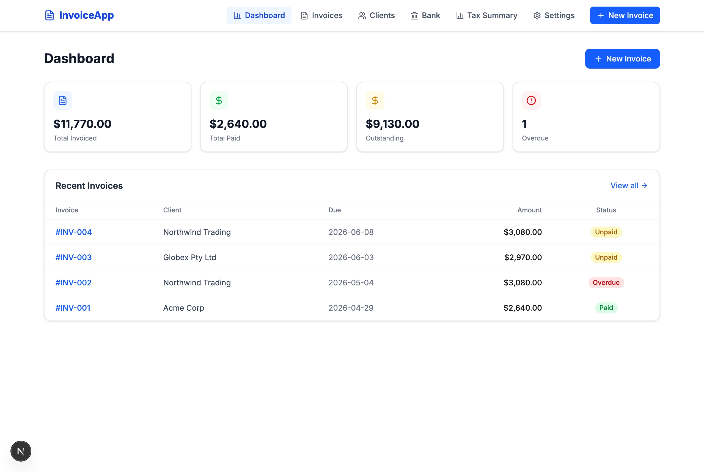
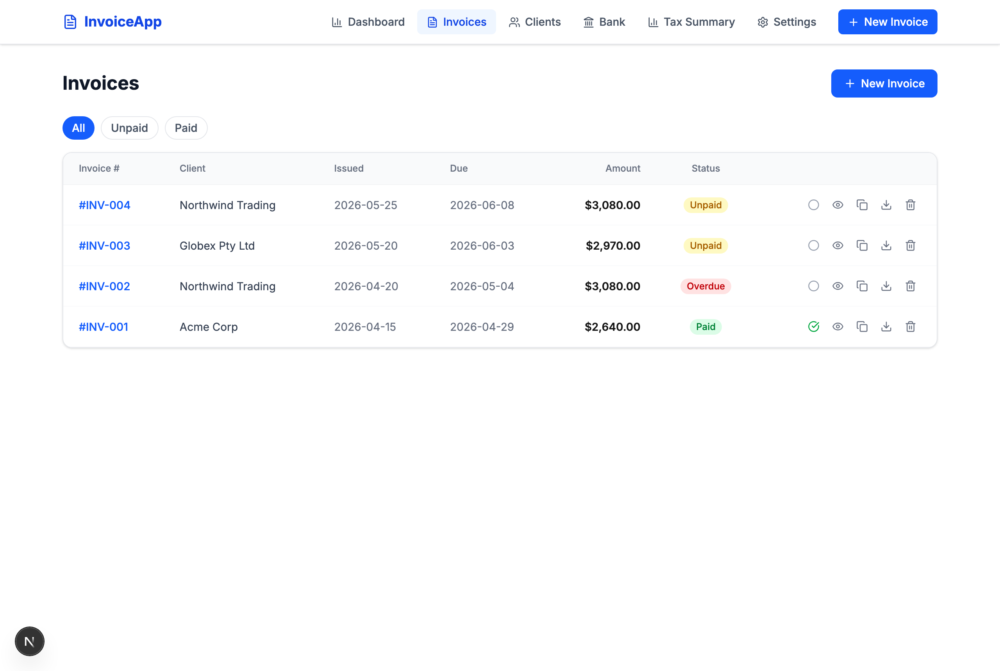
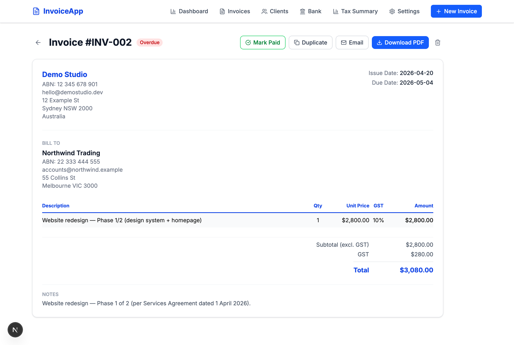
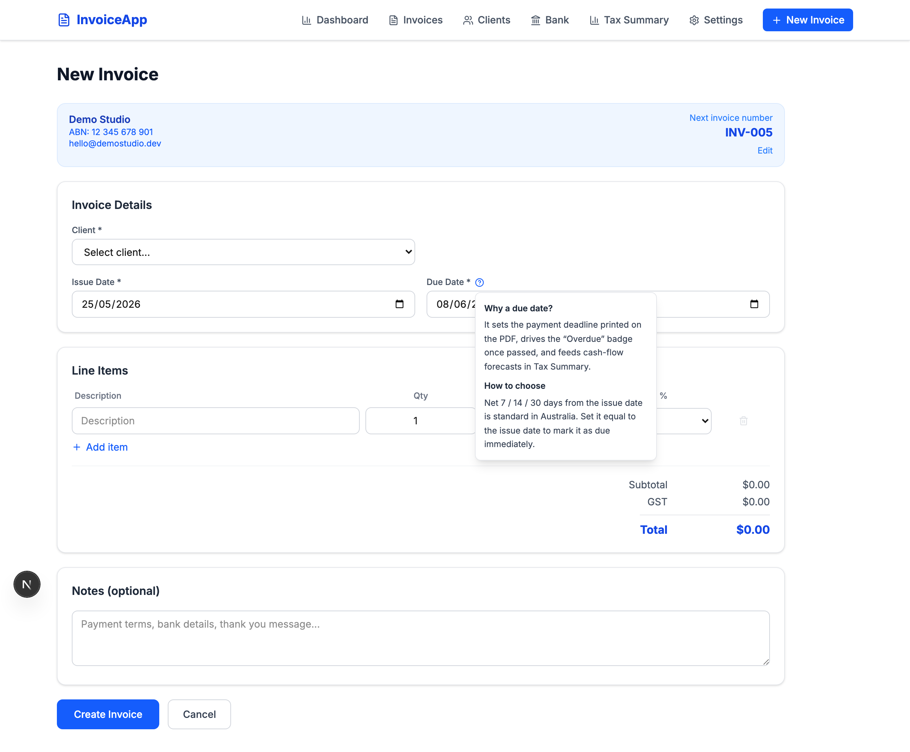
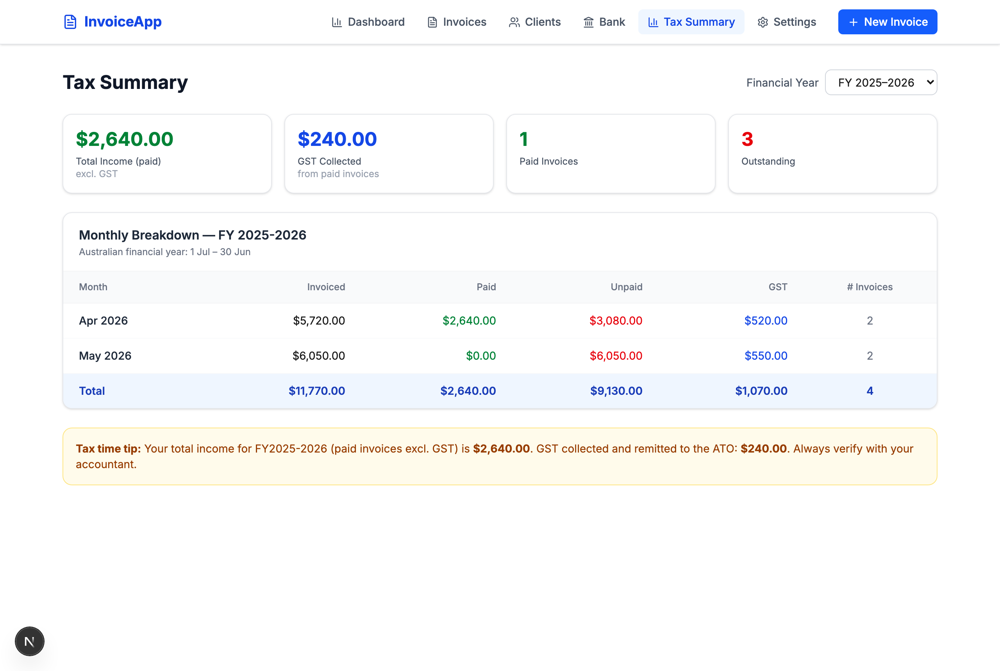
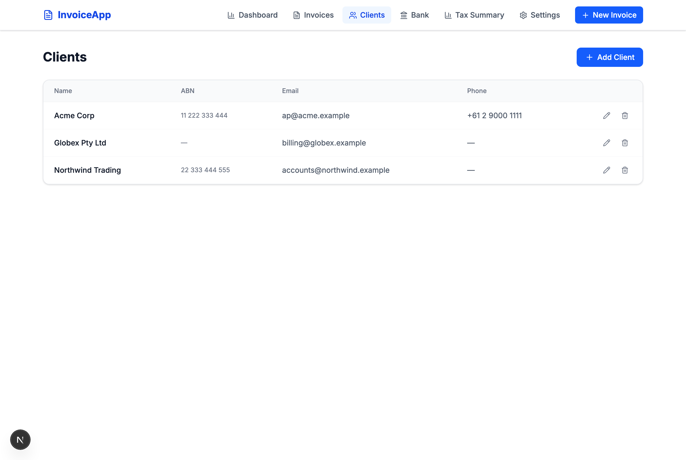

# Invoice App

A self-hosted invoicing tool I built to handle my own freelance billing in Australia — auto-numbered invoices, GST handling, PDF export, and a roadmap toward bank-feed reconciliation via Open Banking.



## Why I built this

Off-the-shelf invoicing SaaS (Xero, Rounded, Hnry) is either overkill or expensive for a one-person freelance operation. I wanted:

- **Total control over the PDF layout** my clients see
- **Auto-incrementing invoice numbers** I never have to think about
- **Split-payment / milestone invoicing** as a first-class action (duplicate an existing invoice, tweak the amount, send Part 2 of 2)
- **A place to grow into** — Open Banking integration scaffolding so reconciling payments to invoices becomes a one-click action once I have more than one client

The app runs entirely on my laptop. No subscription, no data leaving my machine.

## Features

### Invoice list with status at a glance
Paid / Unpaid / Overdue badges driven by due-date logic, with one-click filters and inline actions (mark paid, duplicate, download PDF, delete).



### Professional PDF invoices
Sender details, ABN, GST breakdown, line items, payment terms — all rendered to a downloadable PDF via reportlab.



### Duplicate for split payments
A common freelance pattern: one project, paid in two or three milestones. The Duplicate action pre-fills a new invoice from any existing one, so issuing "Part 2 of 2" takes seconds. Contextual `?` help tooltips explain non-obvious fields like Due Date.



### Tax summary by financial year
Quarterly and monthly breakdown aligned to the Australian financial year (1 Jul – 30 Jun), with GST collected, paid vs. outstanding totals, and per-month invoice count.



### Lightweight client book
Just enough fields to render correct invoices — name, ABN, email, phone, address.



### AI-assisted drafting
Paste an email, chat thread, or scope note — or attach a quote/receipt image or PDF — and Claude pre-fills the New Invoice form: line items, quantities, ex-GST unit prices, GST handling, and dates. It matches the client against your existing client book (or proposes a new one to create in a click). Nothing is saved automatically: the AI produces a **reviewable draft**, you check the numbers, then hit *Create Invoice*. Uses Claude's structured-output mode so the result always maps cleanly onto the invoice schema. Opt-in — set `ANTHROPIC_API_KEY` to enable; the rest of the app works without it.

## Tech stack

| Layer | Choice | Notes |
|---|---|---|
| Backend | FastAPI + SQLAlchemy + SQLite | Pydantic v2 schemas, single-file SQLite DB |
| PDF | reportlab | Hand-rolled layout for full control of the invoice template |
| Frontend | Next.js 16 (App Router) + React 19 | Turbopack dev server |
| Styling | Tailwind CSS v4 | Plus lucide-react for icons |
| AI | Anthropic Claude (Opus 4.8) | Structured-output extraction of invoices from text, images, and PDFs — see `backend/routers/ai.py` |
| Future | Basiq (Open Banking) | Scaffolded — see `backend/routers/bank.py`; activated once client volume justifies the per-user pricing |

## Getting started

Requires Python 3.9+ and Node.js 20+.

```bash
./start.sh
```

This script:
1. Creates a Python venv in `backend/`, installs `requirements.txt`
2. Starts FastAPI on `:8001`
3. Starts Next.js dev server on `:3002`

**Optional — enable AI drafting:** copy `backend/.env.example` to `backend/.env` and add your `ANTHROPIC_API_KEY`. Without it the app runs fine; the AI Assist panel just shows a setup hint.

Then:
- App: <http://localhost:3002>
- API docs (Swagger): <http://localhost:8001/docs>

First-run setup:
1. Go to **Settings** and fill in your business profile (name, ABN, bank details) — without this, invoice creation is blocked
2. Add a **Client**
3. Create an **Invoice**

## Project layout

```
backend/
  main.py               FastAPI entrypoint, CORS, router registration
  models.py             SQLAlchemy models (BusinessSettings, Client, Invoice, LineItem)
  schemas.py            Pydantic schemas for request/response
  pdf_generator.py      reportlab-based invoice PDF renderer
  routers/
    invoices.py         Invoice CRUD, paid toggle, PDF download
    clients.py          Client CRUD
    settings.py         Business profile + auto-numbering counter
    summary.py          FY-aligned tax summary aggregations
    bank.py             Basiq integration (scaffolded)
    ai.py               AI invoice drafting (Claude structured extraction)

frontend/
  app/                  Next.js App Router pages
    invoices/[id]       Invoice detail
    invoices/new        New invoice form (handles ?from=<id> for duplicate)
    invoices/page.tsx   Invoice list
    clients, summary, settings, bank
  components/
    Nav.tsx
    HelpTip.tsx         Reusable ? popover for form-field hints
  lib/api.ts            Typed API client
```

## Status

Personal-use, single-tenant. Not designed for multi-user or production hosting. The SQLite DB lives at `backend/invoice_app.db` and is git-ignored — bring your own data.
